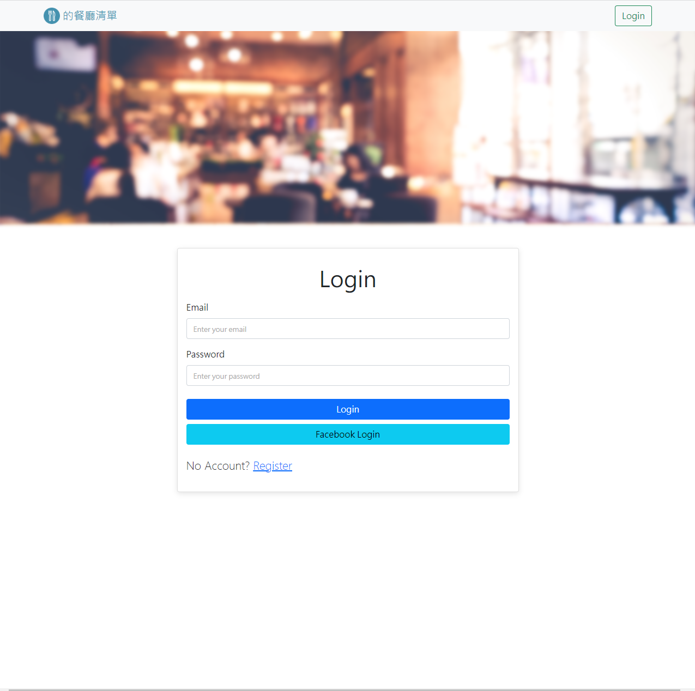
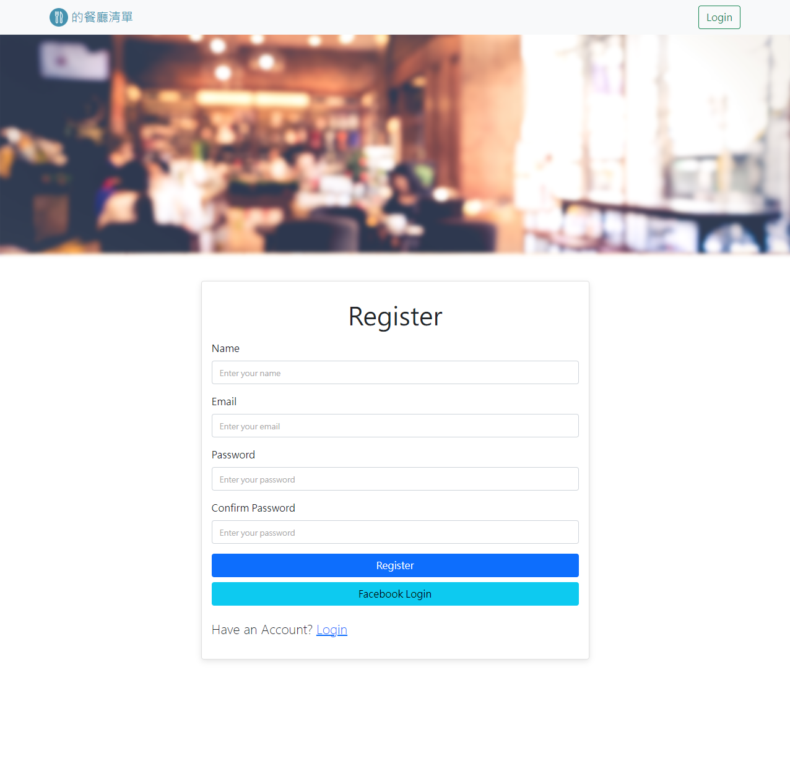

# Restaurant List
A simple web application for restaurant fanatic

## Login & Register Features




- register first then login to use "Homepage Feature"
- also can login via Facebook

## Homepage Features


- listing restaurant from MongoDB
- create new restaurant
- showing restaurant detail 
- edit exist restaurant
- delete restaurant
- searching restaurant by name
- searching restaurant by category
- sort restaurants by chosen condition

## How to use 

1. please confirm you have already installed node.js and npm first
2. clone this repository to your computer
3. use the terminal to access the folder , and then type the command below

   ```bash
   npm install
   ```

4. after the installation complete,set all env params(You can also see example on .envExample file)

   ```bash
   FACEBOOK_CALLBACK = http://localhost:3000/auth/facebook/callback
   FACEBOOK_ID = Your Facebook developer project ID
   FACEBOOK_SECRET = Your Facebook developer project password
   MONGODB_URI =mongodb+srv://<Your MongoDB Account>:<Your MongoDB Password>@cluster0.xxxx.xxxx.net/<Your MongoDB Table><?retryWrites=true&w=majority
   SESSION_SECRET = any string you want
   PORT = 3000
   ```

5. create test data

   ```bash
   npm run seed
   ```   

6. after you created test data , keep typing

   ```bash
   npm run start
   ```

7. if you see this message means the server is on, you can use that URL to go into the website

   ```bash
   App is running on http://localhost:3000
   ```  

8. if you want to stop it, use command below

   ```bash
   ctrl + c
   ```

## Code style
[](https://standardjs.com)

## Tech/framework used

- Node.js v14.16.0
- express v4.17.1
- body-parser v1.20.2
- express-handlebars v4.0.2
- mongoose v5.9.7
- nanoid v3.3.6
- dotenv v16.0.3
- bcryptjs v2.4.3
- connect-flash v0.1.1
- express-session v1.17.1
- passport v0.4.1
- passport-facebook v3.0.0
- passport-local v1.0.0